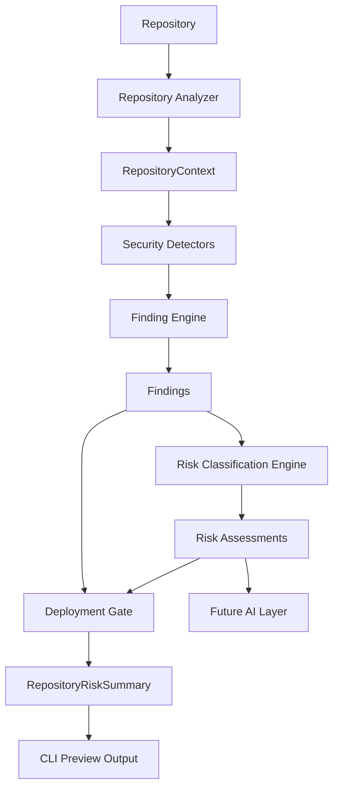
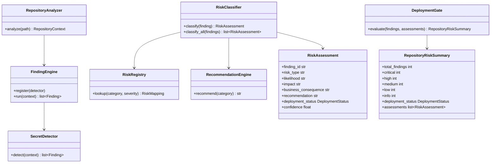

# DevSecScan

DevSecScan is a local, deterministic repository security scanner. Phase 6 adds a rule-based risk classification engine that turns technical findings into business risk assessments and deployment recommendations.

## Updated Architecture Diagram



## Class Diagram



## Data Flow Diagram

```mermaid
flowchart LR
    SourceFiles["Source Files"] --> IgnoreSystem["Ignore System"]
    IgnoreSystem --> FileScanner["FileScanner"]
    FileScanner --> SecretRules["Secret Rules"]
    SecretRules --> Findings["Normalized Findings"]
    Findings --> Registry["Risk Registry"]
    Registry --> Assessments["Risk Assessments"]
    Assessments --> Gate["Deployment Gate"]
    Gate --> Output["Repository Risk Summary"]
```



## Implementation Plan

1. Keep risk mapping local and rule-based.
2. Normalize detector output through `Finding`.
3. Map `(Category, Severity)` pairs through `RiskRegistry`.
4. Generate human-readable remediation through `RecommendationEngine`.
5. Aggregate final repository safety through `DeploymentGate`.
6. Render terminal preview output from `RepositoryRiskSummary`.
7. Preserve ignore support so test fixtures and generated folders do not create findings.
8. Add tests for models, classification, recommendations, gate behavior, ignored paths, summary formatting, and CLI preview output.

## Usage

```powershell
devsecscan .
```

or from source:

```powershell
python -m devsecscan.cli.main .
```

Example output:

```text
Repository Risk Summary

Total Findings: 2
Critical Issues: 1
High Issues: 1
Medium Issues: 0
Low Issues: 0
Info Issues: 0

Deployment Recommendation:
DO_NOT_DEPLOY

Top Risks:
1. Credential Exposure
2. Unauthorized Access
```

## Risk Engine

The risk engine is offline only. It does not call AI providers, cloud APIs, or external services. Future detectors can add new categories or severities by extending the registry mapping without changing the classifier core.

## Ignore System

DevSecScan ignores common generated and fixture paths by default:

```text
tests/
node_modules/
.git/
coverage/
dist/
build/
__pycache__/
.venv/
venv/
```

Add project-specific ignores in `.devsecscanignore`.

## Tests

```powershell
pytest -q
```
