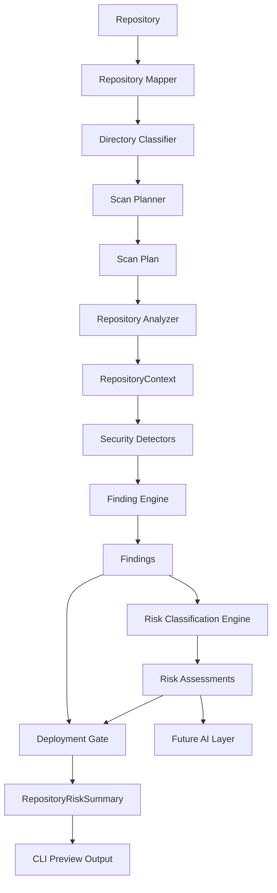
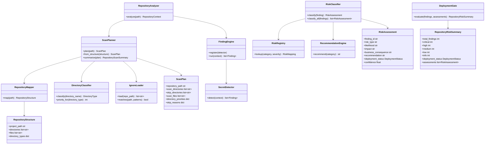

# DevSecScan

DevSecScan is a local, deterministic repository security scanner. Phase 6 added a rule-based risk classification engine, and Phase 6A adds repository mapping plus scan planning so scanners only inspect approved parts of a repository.

## Updated Architecture Diagram



## Class Diagram



## Data Flow Diagram

```mermaid
flowchart LR
    SourceFiles["Repository"] --> Mapper["Repository Mapper"]
    Mapper --> Structure["RepositoryStructure"]
    Structure --> Classifier["Directory Classifier"]
    Classifier --> Planner["Scan Planner"]
    Planner --> ScanPlan["ScanPlan"]
    ScanPlan --> FileScanner["FileScanner"]
    FileScanner --> SecretRules["Secret Rules"]
    SecretRules --> Findings["Normalized Findings"]
    Findings --> Registry["Risk Registry"]
    Registry --> Assessments["Risk Assessments"]
    Assessments --> Gate["Deployment Gate"]
    Gate --> Output["Repository Risk Summary"]
```



## Implementation Plan

1. Keep risk mapping local and rule-based.
2. Normalize detector output through `Finding`.
3. Map `(Category, Severity)` pairs through `RiskRegistry`.
4. Generate human-readable remediation through `RecommendationEngine`.
5. Aggregate final repository safety through `DeploymentGate`.
6. Render terminal preview output from `RepositoryRiskSummary`.
7. Map repositories shallowly before scanning to identify top-level directories and files.
8. Classify directories with an extensible known-directory registry.
9. Generate a `ScanPlan` that includes approved source/config directories and excluded system paths.
10. Preserve ignore support so test fixtures and generated folders do not create findings.
11. Add tests for models, classification, recommendations, gate behavior, ignored paths, scan planning, summary formatting, and CLI preview output.

## Usage

```powershell
devsecscan .
```

or from source:

```powershell
python -m devsecscan.cli.main .
```

Example output:

```text
Repository Risk Summary

Total Findings: 2
Critical Issues: 1
High Issues: 1
Medium Issues: 0
Low Issues: 0
Info Issues: 0

Deployment Recommendation:
DO_NOT_DEPLOY

Top Risks:
1. Credential Exposure
2. Unauthorized Access
```

## Risk Engine

The risk engine is offline only. It does not call AI providers, cloud APIs, or external services. Future detectors can add new categories or severities by extending the registry mapping without changing the classifier core.

## Ignore System

DevSecScan uses `.devsecscanignore` during scan planning and ignores common generated and fixture paths by default:

```text
tests/
node_modules/
.git/
coverage/
dist/
build/
__pycache__/
.venv/
venv/
```

Add project-specific ignores in `.devsecscanignore`.

## Repository Mapper And Scan Planner

Phase 6A introduces a deterministic repository intelligence layer:

```text
Repository
Repository Mapper
Directory Classifier
Scan Planner
Scan Plan
Repository Analyzer
Security Detectors
Risk Engine
```

Directory priorities:

```text
SOURCE_CODE = 100
CONFIGURATION = 90
TEST_CODE = 40
DOCUMENTATION = 10
UNKNOWN = 20
ENVIRONMENT = 0
DEPENDENCIES = 0
CACHE = 0
BUILD_OUTPUT = 0
METADATA = 0
```

Security detectors consume the scan plan instead of walking the repository directly.

## Tests

```powershell
pytest -q
```
